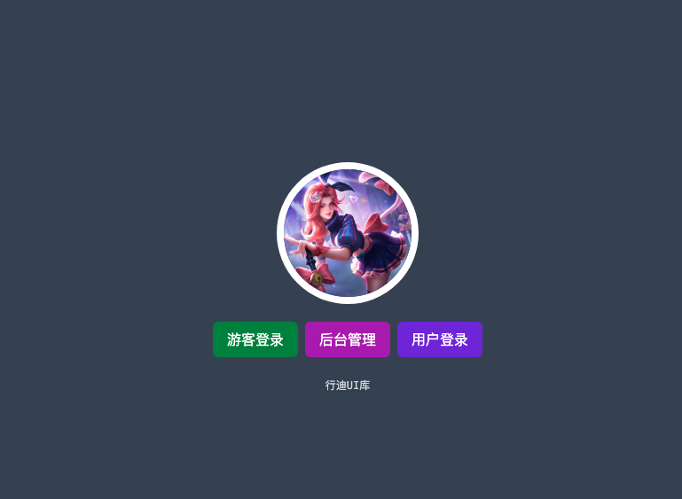
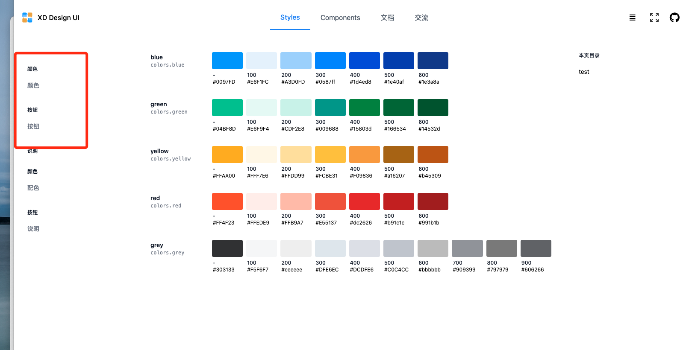
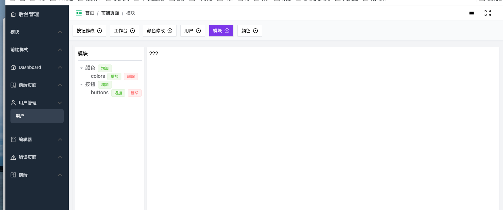
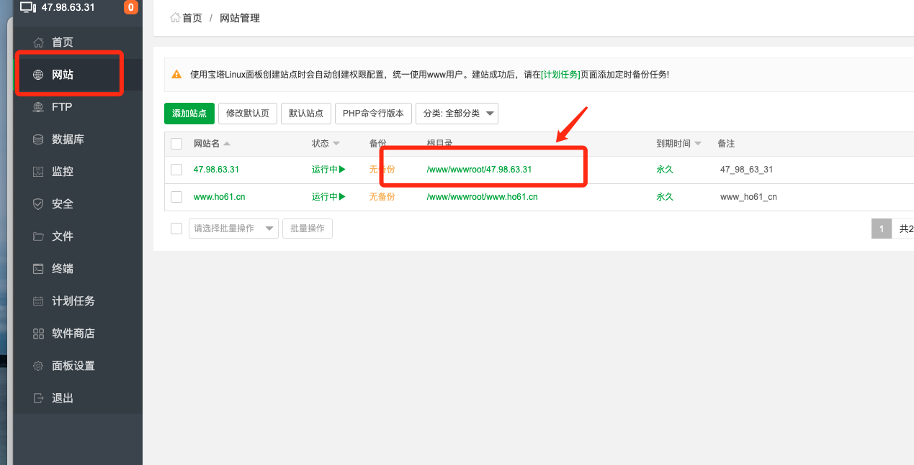
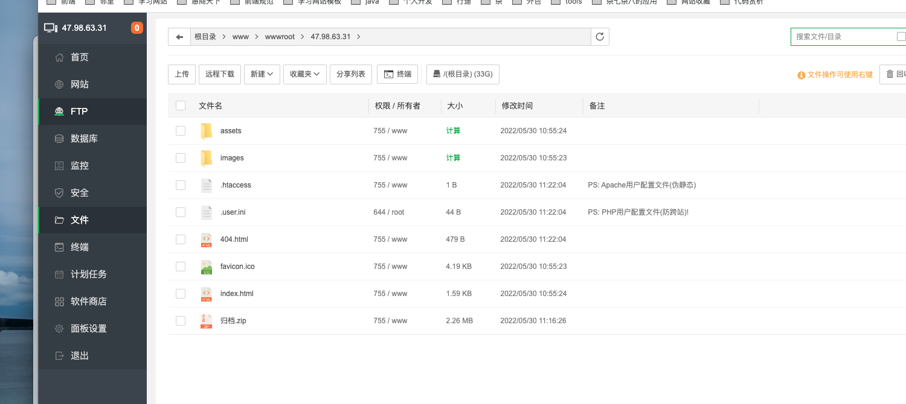
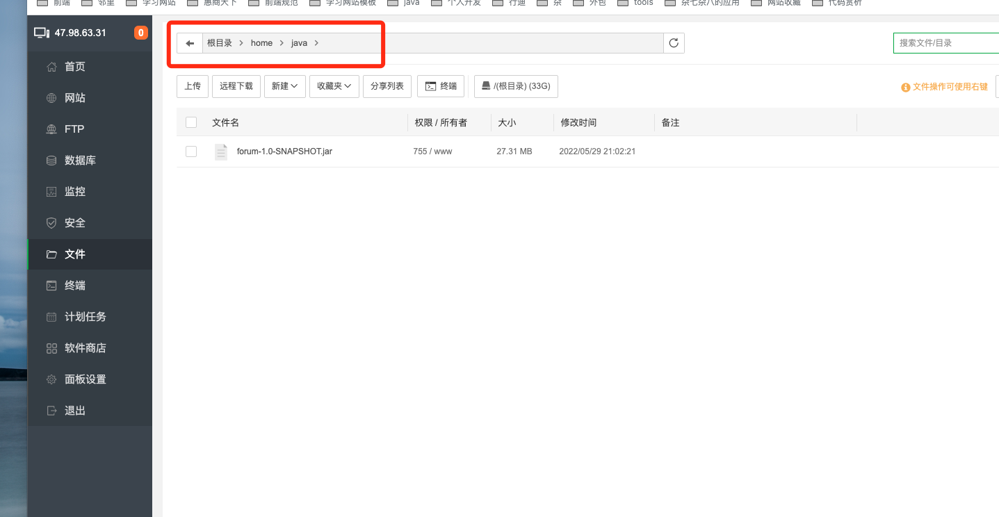
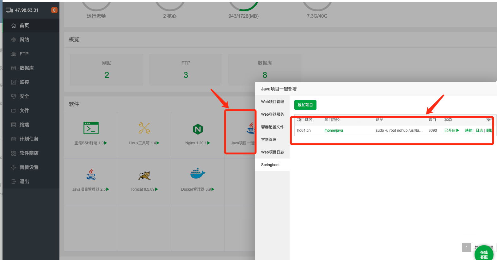

# 前端脚手架

### 目的
- 本着熟悉和了解前端最新技术，所以采用了最新技术
- 统一公司前端样式，制定样式标准，节省开发时间
- 后期增加交流板块，建立知识库体系。大家可以分享自己觉得好的知识

### 框架
- 打包： vite [yarn](https://doc.houdunren.com/soft/6%20yarn.html#%E6%9F%A5%E7%9C%8B%E8%BD%AF%E4%BB%B6)
- vue3
- [element3](https://element-plus.org/zh-CN/)
- [typescript](https://ts.xcatliu.com/) (搜的简单教程)
- [pina](https://pinia.vuejs.org/) （axios的下个版本）

### 代码
基于vue3+typescript的前端脚手架项目，可以帮助你快速构建构建前端项目。
- [前端](https://git.thinkdid.com/think-incubator/think_ui_static) (整体参考后盾人脚手架这一这部分)
- [后端](https://git.thinkdid.com/think-incubator/think_ui_admin_static)


### 项目说明

- 游客登录 前端展示页面
- 后台管理直接进入编辑页面
- 需要账号密码登入
- 补充说明：本想着超级管理员和管理员分开，可以的话后期添加后台人员的账号



- 说明
  styles放公共样式
  components放table这样的组件，不需要看代码，阅读文档就该知道如何使用
  文档部分放项目中用到的组件，api等
  交流板块后期类似于知识库
- 前端主要展示页面，红框及展示数据由后台页面生成
- 生成页面的话，需要再view/front/styleComponents目录下写好对应页面，后台配置对应的权限


- 后台配置


## 安装

使用git下载项目

```
#github
git clone https://github.com/houdunwang/vue.git

#gitee
git clone https://gitee.com/houdunren/vue.git
```


安装依赖包

```
#npm
npm install

#yarn 
yarn 

#pnpm
pnpm install
```

## 部署
[个人服务器](http://47.98.63.31:8888/login)
账号：v07epxgj
密码：46f006b2


- vite build后的内容放在该目录下




- 后端
  连本地的话 先导入xd-springboot-forum.sql
1.jar包放在该目录下

2.重启

